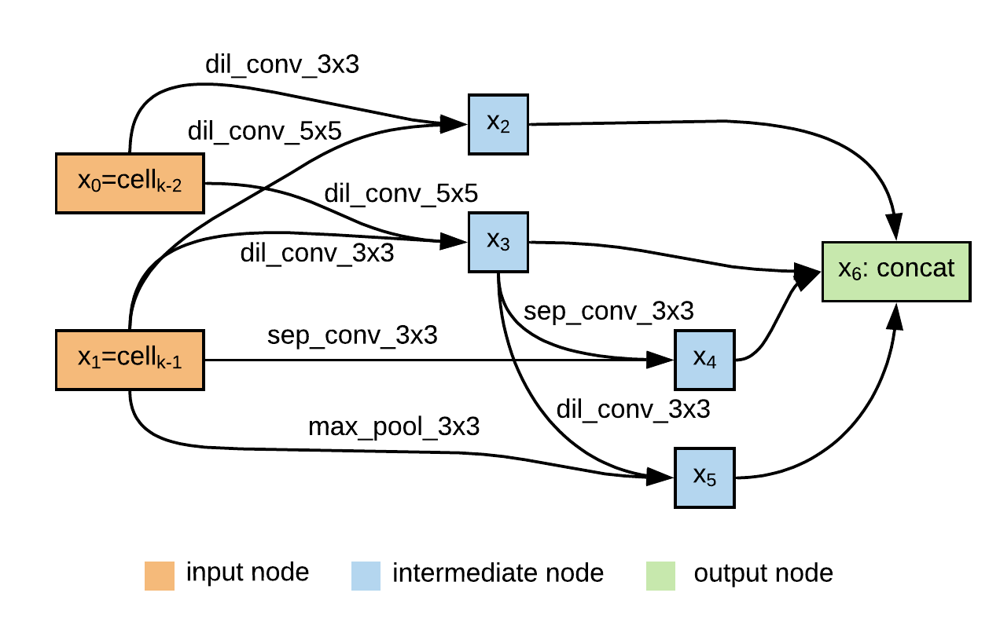

# AutoSpeech: Neural Architecture Search for Speaker Recognition

Code for this paper [AutoSpeech: Neural Architecture Search for Speaker Recognition](https://arxiv.org/abs/2005.03215)

Shaojin Ding*, Tianlong Chen*, Xinyu Gong, Weiwei Zha, Zhangyang Wang

## Overview
Speaker  recognition  systems  based  on  Convolutional  Neural Networks (CNNs) are often built with off-the-shelf backbones such as VGG-Net or ResNet. However, these backbones were originally proposed for image classification, and therefore may not  be  naturally fit for  speaker  recognition.   Due  to  the  prohibitive complexity of manually exploring the design space, we propose the first neural architecture search approach approach for the speaker recognition tasks, named as **AutoSpeech**. Our evaluation results on [VoxCeleb1](http://www.robots.ox.ac.uk/~vgg/data/voxceleb/vox1.html) demonstrate  that  the  derived  CNN  architectures  from  the  proposed approach significantly outperform current speaker recognition systems  based  on  VGG-M,  ResNet-18,  and  ResNet-34  back-bones, while enjoying lower model complexity.

## Results

Our proposed approach outperforms speaker recognition systems based on VGG-M, ResNet-18, and ResNet-34 backbones. The detailed comparison can be found in our paper.

|    Method     | Top-1 |  EER  | Parameters | Pretrained model 
| :------------: | :---: | :---: | :---: | :---: | 
|  VGG-M    | 80.50 | 10.20 | 67M | [iden/veri](https://github.com/a-nagrani/VGGVox) |
| ResNet-18 | 79.48 | 12.30 | 12M | [iden](https://drive.google.com/file/d/16P071LB1kwiQEoKhQRD-B3XBSwQR_6eG/view?usp=sharing), [veri](https://drive.google.com/file/d/1uNA34GTPBmrlG2gTwgrhkTfsn7zBnC7d/view?usp=sharing) |
| ResNet-34 | 81.34 | 11.99| 22M | [iden](https://drive.google.com/file/d/1UJ_N5hQkVESifNJlvFdCte0yMPaqbaXJ/view?usp=sharing),  [veri](https://drive.google.com/file/d/1JD34RhuvDoc19ulWQNPNArSKfDXpUYud/view?usp=sharing) |
| Proposed  | **87.66** | **8.95** | **18M** | [iden](https://drive.google.com/file/d/1Ph4atwl603xrbiq8OkvjdINGBCIQyXy9/view?usp=sharing),  [veri](https://drive.google.com/file/d/16TrxrkRK5A0J6UxjYrQHUlEBdAESC087/view?usp=sharing) |

### Visualization

left: normal cell. right: reduction cell
<p align="center">


</p>

## 

## Quick start
### Requirements
* Python 3.7

* Pytorch>=1.0: `pip install torch torchvision`

* Other dependencies: `pip install -r requirements`

### Dataset
[VoxCeleb1](http://www.robots.ox.ac.uk/~vgg/data/voxceleb/vox1.html): You will need `DevA-DevD` and `Test` parts. Additionally, you will need original files: `vox1_meta.csv`, `iden_split.txt`, and `veri_test.txt` from official website. Alternatively, the dataset can be downloaded using `dl_script.sh`.

The data should be organized as:
* VoxCeleb1
   * dev/wav/...
   * test/wav/...
   * vox1_meta.csv
   * iden_split.txt
   * veri_test.txt
   
### Running the code
* data preprocess:

    `python data_preprocess.py /path/to/VoxCeleb1`
    
    The output folder of it should be:
    * feature
        * dev
        * test
        * merged
    
    dev and test are used for verification, and merged are used for identification.

* Training and evaluating ResNet-18, ResNet-34 baselines:

    `python train_baseline_identification.py --cfg exps/baseline/resnet18_iden.yaml`
    
    `python train_baseline_verification.py --cfg exps/baseline/resnet18_veri.yaml`
    
    `python train_baseline_identification.py --cfg exps/baseline/resnet34_iden.yaml`
    
    `python train_baseline_verification.py --cfg exps/baseline/resnet34_veri.yaml`
    
    You need to modify the `DATA_DIR` field in `.yaml` file.

* Architecture search:

    `python search.py --cfg exps/search.yaml`
    
    You need to modify the `DATA_DIR` field in `.yaml` file.
    
* Training from scratch for identification:
    
    `python train_identification.py --cfg exps/scratch/scratch.yaml --text_arch GENOTYPE`
    
    You need to modify the `DATA_DIR` field in `.yaml` file.
    
    `GENOTYPE` is the search architecture object. For example, the `GENOTYPE` of the architecture report in the paper is:
    
    `"Genotype(normal=[('dil_conv_5x5', 1), ('dil_conv_3x3', 0), ('dil_conv_5x5', 0), ('sep_conv_3x3', 1), ('sep_conv_3x3', 1), ('sep_conv_3x3', 2), ('dil_conv_3x3', 2), ('max_pool_3x3', 1)], normal_concat=range(2, 6), reduce=[('max_pool_3x3', 1), ('max_pool_3x3', 0), ('dil_conv_5x5', 2), ('max_pool_3x3', 1), ('dil_conv_5x5', 3), ('dil_conv_3x3', 2), ('dil_conv_5x5', 4), ('dil_conv_5x5', 2)], reduce_concat=range(2, 6))"`

* Training from scratch for verification:
    
    `python train_verification.py --cfg exps/scratch/scratch.yaml --text_arch GENOTYPE`


* Evaluation:

  * Identification

    `python evaluate_identification.py --cfg exps/scratch/scratch_iden.yaml --load_path /path/to/the/trained/model`

  * Verification
  
    `python evaluate_verification.py --cfg exps/scratch/scratch_veri.yaml --load_path /path/to/the/trained/model`


## Citation

If you use this code for your research, please cite our paper.

```
@misc{ding2020autospeech,
    title={AutoSpeech: Neural Architecture Search for Speaker Recognition},
    author={Shaojin Ding and Tianlong Chen and Xinyu Gong and Weiwei Zha and Zhangyang Wang},
    year={2020},
    eprint={2005.03215},
    archivePrefix={arXiv},
    primaryClass={eess.AS}
}
```

## Acknowledgement

Part of the codes are adapted from [deep-speaker](https://github.com/philipperemy/deep-speaker) and [Real-Time-Voice-Cloning](https://github.com/CorentinJ/Real-Time-Voice-Cloning).
